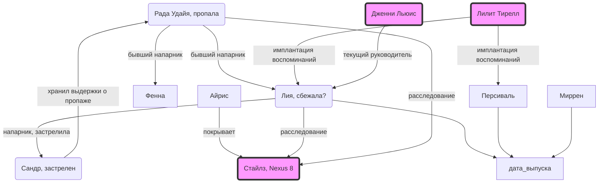
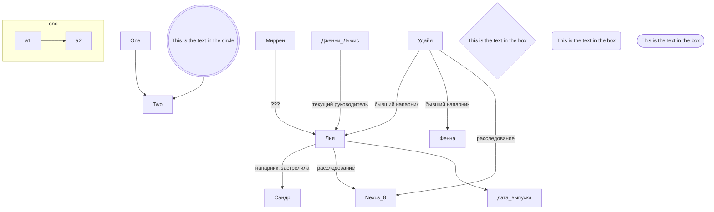

# bladerunner-2024-06-08

## Team

* Сарё Олсон Беккер энфорсер силовик участнк даижения за права репликантов. Извне Земли!
* Вильям Новак больше 15 алкоголик и курильщик бюрократ со связями
* fn9-2.39 Фенна работа под прикрытием, проникновение

Сейчас 15 мая

White dragon noodle

прошлой ночью первый сектор снейк пит двое сотрудников блейдранников LH LSN Лия и Сандр. Сандр погиб. Лия LH4793 пропала. сложности с орагнизацией труда и тайм менеджментом.
Есть адрес Сандра! 5ый сектор хогвартс стрит 21 этаж 27 кв 90
Лия комбатант
менталка LEV C
физуха A
ровестница
Лия - просраны все тесты, рекалибрация 8 мая 2037
раздражение и агресия
калибровка не надолго помогла
!!! Жалобы на повторяющиеся навязчивые кошмары. Маленькая черноволосая девочка, что-то про атаку.

репортили Дженни Льюис, много работали в 1 секторе. есть запросы в 4 сектор (пром корп). у неё и сандра есть запросы по северной части пятого - чайна таун и рядом.

Сандр тоже комбат
расследовали восьмёрок
14 февраля совсем новый
LEV B
По калибровкам всё ок

Лию загружала в дела Удайя. Пропала месяц назад. ИНФОРМАЦИЯ ЗАСЕКРЕЧЕНА.
Есть домашний адрес  Лии.
Миррен расспросить про Лию
Lilith Memory Lab разработала память Лии
Кто разрабатывал воспоминания Сандра - хз. А наши?

расследовали возможную активность нексус 8 в 1 секторе, зоне развлечений. злачный район.
гавёная загрузка информации

Связаться с Куэл, QL, их пиар менеджер из корп Уоллас. В штаб квартиру.
Тело Сандра - в крим лабе
Покопаться в мейнфрейме инфа по ним
Может что-то на камерах
Базовая информация - в агентах

Айрис танцовщица репликант

человеческий супрематизм

Мирелл, сон . ей 15-12, брату 12. Кипл - не место для игр. Не слушает, идёт туда. Слишком обижена. Привозят тело.

## подсказки

* key memory - успешнее бросок
* key relationship - получит человечности
* key item - снять стресс

