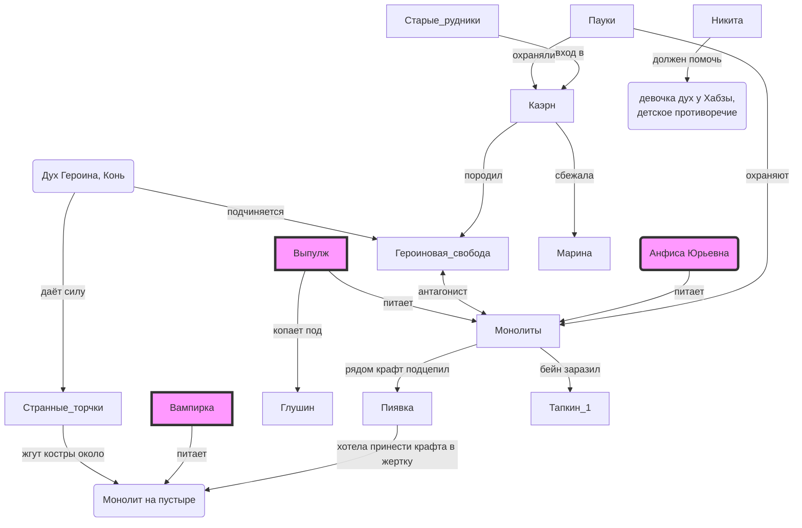

## подсказки

## Монолиты

* у Крафта была гипотеза, что они связаны с некоторыми людьми — питаются их силой или наоборот — дают силу им.
* в 70е уже были, в 90е стали более выраженными
* Монолит - Дух системного разложения, коррупеюуии, кумовства, безысходности. Источник - котлован.
* Торчки одновременно и под монолитом и под героиновым конём ходят. Интересно, можно ли тут раскрутить, что мол один у другого клиентскую базу отжимает...

