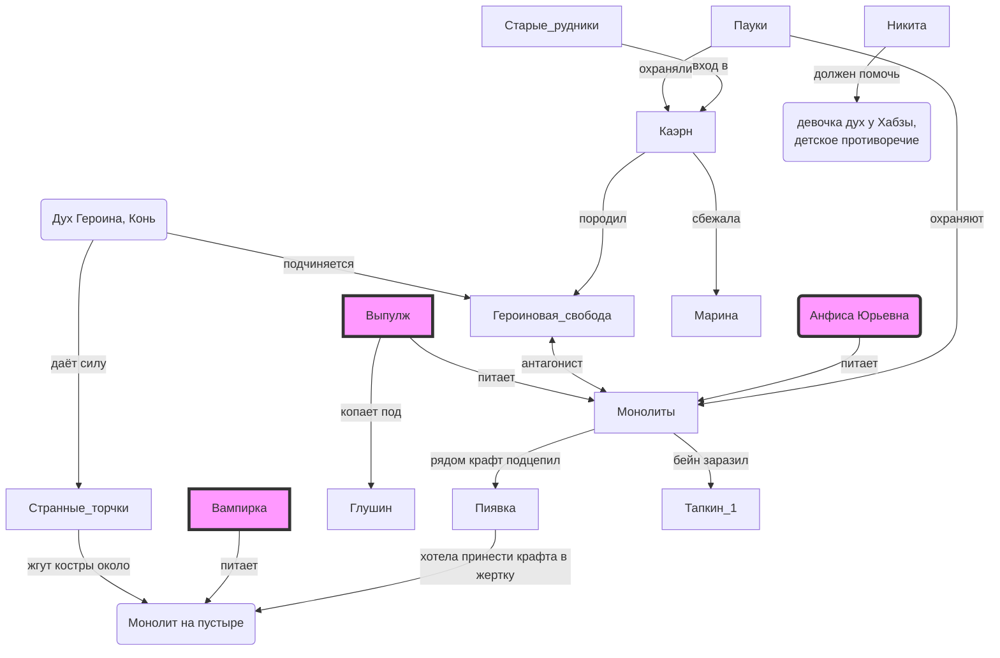

## подсказки

## Монолиты

* у Крафта была гипотеза, что они связаны с некоторыми людьми — питаются их силой или наоборот — дают силу им.
* в 70е уже были, в 90е стали более выраженными
* Монолит - Дух системного разложения, коррупеюуии, кумовства, безысходности. Источник - котлован.
* Торчки одновременно и под монолитом и под героиновым конём ходят. Интересно, можно ли тут раскрутить, что мол один у другого клиентскую базу отжимает...

## Куда идти дальше

* Анфиса Юрьевна
* Вампирка
* Выполж и ГОК
* Оставшиеся Тапкины
* Вонзать коня?
* К зав музея, вдруг что для каэрна выгорит?
* Ко внешним пацанам, за нужным ритуалом для каэрна, может позвать их заодно?
* Раскачать Глушина?
* Смотреть через стёкла
* Познакомиться с местными духами, и олдовым гару

## Куда идти дальше V2

* Так или иначе освоить ритуал изгнания злого зла
 * навести фбровцев на гарри поттера и след крафта, вдруг им хватит и они отстанут
 * предложить Глушнину сдать Выпулжа как корень всех зол и возвыситься
* стравить между собой ебучих духов. А то хули они не делят полянку!
* пообщаться с Анфисой Юрьевной. Хотя бы чтобы понять, кого закапывать следующим!
* всем вместе устроить фестиваль имени Жени Гериной
* Докопаться до второго старика, и выяснить, что может его воодушевить. Чтобы хотя бы двух старых Гару взять на побоище
* Закопать или залить котлован. Что б нет.
* Доебаться до внешних Гару и позвать их вонзать монолит вместе. Но не каэрн! Каэрн мы сами )
* Эээ.... Вампирка.... Ээээ. Ну посмотреть хотя бы. Потом ей наверное всё равно ноги сломают.

После этого можно в целом и на монолит....
## заметки

* не бросать деда Бурова, он начал говорить!

